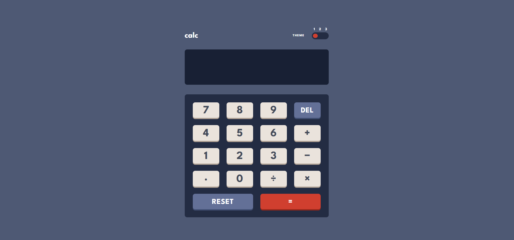
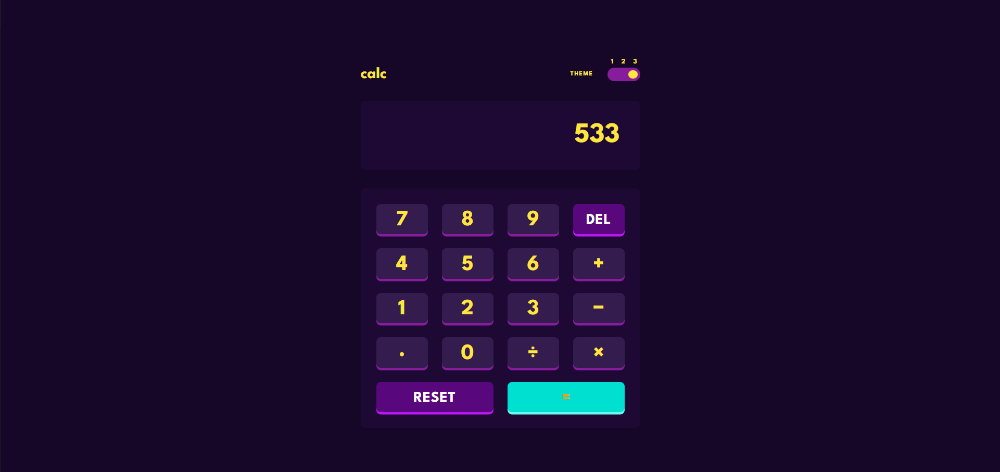
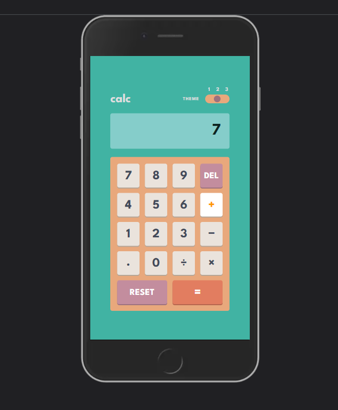

# Calculator

A thematic and responsive calculator application that allows users to easily add, subtract, multiply, and divide positive integers and floating point numbers.

## Link

Try it here: https://calculator-eight-drab.vercel.app/
## Screenshots

 

 

 

## Description

This is a basic calculator application I built using HTML, CSS, and JavaScript. It is a challenge from Frontend Mentor, which you can learn more about [here](https://www.frontendmentor.io/challenges/calculator-app-9lteq5N29). I changed the second theme to a more pastel-ish one that I felt was unique and easy on the eyes.

## Functionality

This application functions like a typical basic calculator. Users can chain equations, e.g., '1' + '2' (3) x '2' (6), utilize the equals key ('=') to make calculations, e.g., '50' - '20' = (30), or use a combination of both: '3' x '5' (15) + '5' (20) / '2' = (10) + 6 (16).

Users also have the ability to delete inputted values with the 'DEL' key: '1256' 'DEL' = (125), and reset their calculation history using the 'RESET' key.

Finally, I have included three themes for the user to choose from. The default theme is the light theme, the second theme is a pastel theme, and the third theme is a dark theme.

## Technology

I spent a great deal of time debugging the various ways in which the user could potentially produce an error in the course of their calculations (for example, using the equals key or other operands early, attempting to add multiple decimals, dividing by zero, etc.) I used the MVC architecture for this project for extra practice. Although the no-frills state model seems a bit basic at first glance, I felt it adequately provided me with the means to save and access all user inputs.
In the future, I think it would be helpful to add the commas for larger integers to help make them easier to read, enable keyboard events so that the user can use their keyboard to make calculations, and perhaps add more operands like negative values, square roots, or exponents.

HTML
 
CSS
 
JavaScript
 
MVC architecture
 
Mobile responsiveness

